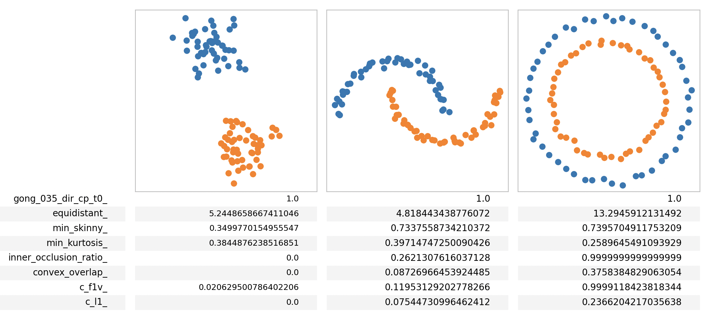

# Multiclass Scatterplot Features

About
-----
* Multiclass Scatterplot Features implemented based on: Bae, Fujiwara, Tseng, and Szafir, "Uncovering How Scatterplot Features Skew Visual Class Separation." Proc. CHI, 2025 (forthcoming).
  * **New quantitative measures of multiclass scatterplot features** that instantiate conceptual features proposed in Sedlmair et al. ["A taxonomy of visual cluster separation Factors."](https://doi.org/10.1111/j.1467-8659.2012.03125.x) CGF, 2012
  * Python implementation of **visual class separation measures**.
    * SepMe from Aupetit and Sedlmair, ["SepMe: 2002 New Visual Separation Measures."](https://doi.org/10.1109/PACIFICVIS.2016.7465244) Proc. PacificVis, 2016.
    * Distance Consistency (DSC) and Distribution Consistency (DC) from Sips et al. ["Selecting Good Views of High-dimensional Data Using Class Consistency."]( https://doi.org/10.1111/j.1467-8659.2009.01467.x) CGF, 2009.
    * Desity-aware DSC and Density-aware KNNG from Wang et al., ["A Perception-Driven Approach to Supervised Dimensionality Reduction for Visualization".](https://doi.org/10.1109/TVCG.2017.2701829) IEEE TVCG, 2018.
  * **Python implementation of scagnostics** measures described in Wilkinson et al. ["High-Dimensional Visual Analytics: Interactive Exploration Guided by Pairwise Views of Point Distributions."](https://doi.org/10.1109/TVCG.2006.94) IEEE TVCG, 2006.
  * **Class complexity features** modified to support NumPy 2 from [PyMFE](https://pymfe.readthedocs.io/en/latest/index.html) and Lorena et al., ["How Complex Is Your Classification Problem?: A Survey on Measuring Classification Complexity."](https://doi.org/10.1145/3347711) ACM Computing Surveys, 2019.
  
* In addition, data geneation code is availabe
  * Data downloader from  Sedlmair and Aupetit’s two-class scatterplots, UCI Machine Learning Repository, VisuMap Datasets,  Jeon et al.’s clustering validation datasets, and OpenML datasets.
  * Scatterplot data (i.e., 2D data) generator from the high-dimensional data using multiple dimensionality reduction methods.
  * Multiclass scatterplot feature extraction from the binalized scatterplot datasets.
******

Requirements
-----
* Python3
* Note: Tested on macOS Sonoma.
******

Setup (multiclass-scatterplot-features)
-----
* Install with pip3. Move to the directory of this repository. Then,

    `pip3 install .`

******

Usage (multiclass-scatterplot-features)
-----
* Import installed modules from python (e.g., `from multiclass_scatterplot_features import MulticlassScatterFeatures`). See sample.py for examples.
* Detailed documentations of functions, classes, methods can be found in each corresponding python script as well as `doc/index.html`.
******

Data Generator
-----
* Data generation code is provided in `data_generator`
* `sample.py` demonstrates an example use.
* To conviniently install all required packages, run `pip3 intall -r requirements.txt` after moving to `data_generator` directory.
    * Note: Currently, `phate` and `ccpca` need to be installed manually. Follow the instruction described in `sample.py`.
******

## How to Cite
Please, cite:    
* S. Sandra Bae*, Takanori Fujiwara*, Chin Tseng*, and Danielle Albers Szafir. "Uncovering How Scatterplot Features Skew Visual Class Separation," Proc. CHI, 2025 (forthcoming). (*equally contributed)